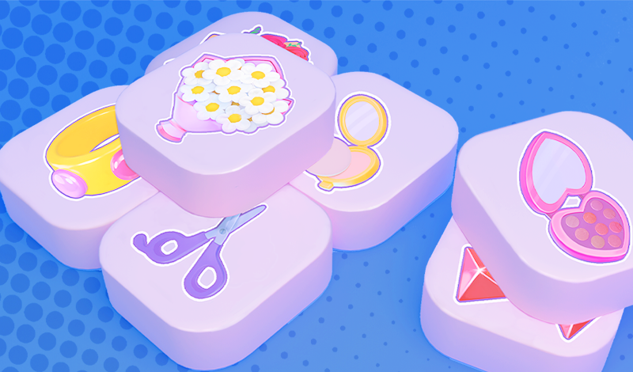
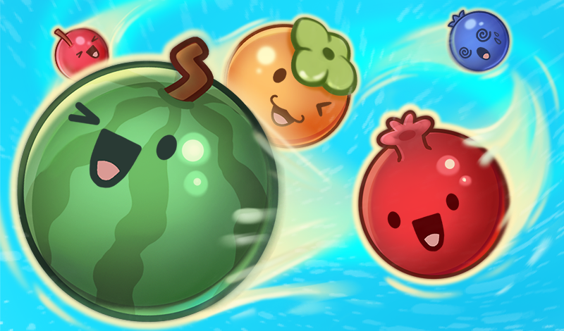

# Aleksandr Panchenko
**`Unity developer`**

I'm a Unity Developer currently working in HTML5 games development.

### Technologies

 

#
### Tools

 

#
### Contacts:

  

    
    &nbsp&nbsp
    
    &nbsp&nbsp
    
  

  
  #
  ### Projects:
  #### Russes vs Lizards: Eggfall

  

     
       
       
       
       
       
       
       
       
       
      
  

  #### Tile Fusion
  

     
       
       
       
       
       
       
       
       
       
      
  

  #### Juicy Fruit
  

     
       
       
       
       
       
       
       
       
       
       
       
  

#
  #### GitHub Stats
  
