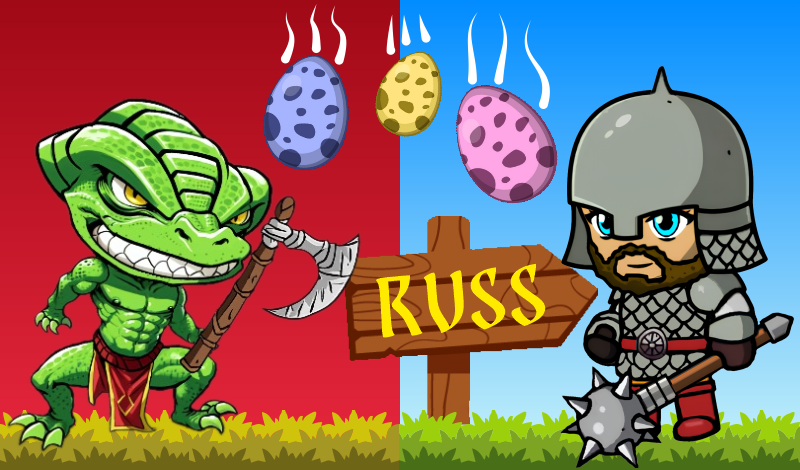

# Aleksandr Panchenko
**`Unity developer`**

I'm a Junior+ Unity Developer.

### Technologies

 

#
### Tools

 

#
### Contacts:

  

    
    
  

  
  #
  ### Projects:
  #### Russes vs Lizards: Eggfall

  

     
       
       
       
       
       
       
       
       
       
      
  

#
  
